# Spotify Music Analytics Platform - NoSQL MongoDB

Цей проєкт демонструє повний цикл роботи з MongoDB: від завантаження даних, трансформації схеми, написання оптимізованих запитів до аналітичних пайплайнів та оптимізації через індекси.

**Датасет:** Spotify Tracks Dataset (Kaggle) - ~114 000 треків із аудіо-характеристиками.

---

## Налаштування оточення

### Встановлення залежностей

```bash
# Встановити Python залежності (для завантаження CSV)
pip install -r requirements.txt

# Залежності: pandas, pymongo
```

### Конфігурація

1. Створіть файл `.env` у кореневій папці за прикладом `.env.example`:
```
MONGO_URI=mongodb+srv://<user>:<password>@<cluster>.mongodb.net/?retryWrites=true&w=majority
```

2. Не комітьте `.env` - він вже в `.gitignore`

### Порядок запуску скриптів
для збереження ходу думок трансформація залишена в два етапи

встановити змінні з `.env` в поточну сесію термінала

`$env:MONGO_URI = (Get-Content .env | Select-String '^MONGO_URI=').ToString().Split('=',2)[1]`


```bash
# 1. Завантажити сирі дані в tracks_raw
python scripts/01_load_data.py

# 2. Трансформувати у документо-орієнтовану схему tracks
mongosh "$env:MONGO_URI" --file scripts/02_transform.js

# 2.1 Агрегація жанрів у масив
mongosh "$env:MONGO_URI" --file scripts/03_consolidate_genres.js

# 3. Виконати запити частини 2
mongosh "$env:MONGO_URI" --file queries/part2_queries.js

# 4. Виконати аналітичні пайплайни частини 3
mongosh "$env:MONGO_URI" --file queries/part3_aggregations.js

# 5. Виконати аналіз індексів частини 4
mongosh "$env:MONGO_URI" --file queries/part4_indexes.js
```

---

## Схема даних

Колекція `tracks_by_genres` містить документи з такою структурою:

```json
{
   "_id": "ObjectId",
   "track_id": "string",
   "track_name": "string",
   "album_name": "string",
   "artists": ["array of strings"],
   "track_genres": ["array of strings"],
   "explicit": boolean,
   "popularity": number,
   "duration_sec": number,
   "popularity_tier": "string (high|medium|low)",
   "audio_features": {
      "danceability": number,
      "energy": number,
      "loudness": number,
      "speechiness": number,
      "acousticness": number,
      "instrumentalness": number,
      "liveness": number,
      "valence": number,
      "tempo": number,
      "key": number,
      "mode": number,
      "time_signature": number
   }
}
```

**Приклад документа:**
```json
{
   "_id": "ObjectId(\"507f1f77bcf86cd799439011\")",
   "track_id": "7qiZfU4dY1lsylvNEJUUm",
   "track_name": "Example Track Name",
   "album_name": "Example Album",
   "artists": ["Artist Name"],
   "track_genres": ["pop", "dance"],
   "explicit": false,
   "popularity": 75,
   "duration_sec": 213.1,
   "popularity_tier": "high",
   "audio_features": {
      "danceability": 0.745,
      "energy": 0.802,
      "loudness": -4.5,
      "speechiness": 0.033,
      "acousticness": 0.15,
      "instrumentalness": 0.009,
      "liveness": 0.18,
      "valence": 0.821,
      "tempo": 123.0,
      "key": 0,
      "mode": 1,
      "time_signature": 4
   }
}
```

**Ключові рішення дизайну:**
- `track_genres` - масив, оскільки один трек може мати кілька жанрів
- `artists` - масив, оскільки існують треки з декількома артистами (колаборація)
- `audio_features` - вкладений об'єкт для логічного групування аудіо-атрибутів
- `popularity_tier` - обчислюване поле для категоризації популярності

---

## Результати запитів та аналіз

У файлі examples\exampe_new_colection.json наведені приклади схеми колекції сирих даних після завантаження, та після трансформації.

Я помітив, що в джерельному CSV один і той самий трек може бути віднесений до кількох жанрів. Якщо зберігати такі записи як окремі документи з різним значенням жанру, виникають дублікати, які спотворюють результати запитів і статистику. Тому я обрав модель з одним документом на один трек і зберігаю жанри окремим масивом `track_genres`. Це дозволяє зберегти всі жанрові прив’язки без дублювання треків і отримувати коректніші результати аналітики.
**Відповіді на теоретичні питання**
1.2

Atlas atlas-l534xi-shard-0 [primary] spotify> db.tracks.countDocuments()
113999

Atlas atlas-l534xi-shard-0 [primary] spotify> db.tracks_by_genres.countDocuments()
89740

- **Чому аудіо-характеристики винесені в окремий об’єкт `audio_features`, а не зберігаються плоско? Коли таке вкладення вигідне, а коли створює проблеми?**
  - Винесення пов'язаних полів у `audio_features` логічно групує аудіо-атрибути, робить документ читабельнішим і полегшує запити/агрегації за цими характеристиками (наприклад, `audio_features.danceability`). Вкладення вигідне коли поля використовуються разом і семантично пов'язані; воно зменшує кількість кореневих полів і покращує організацію схеми. Проблеми з'являються якщо потрібні індекси або часті запити по окремим полям з різних контекстів - в таких випадках треба продумати індексацію або денормалізацію.

- **Чому виконавці зберігаються як масив, а не як рядок? Які запити стають простішими?**
  - Масив дозволяє коректно моделювати ситуацію з кількома артистами, робить простішими запити типу `find({ artists: "Name" })`, агрегації з `$unwind`, підрахунок треків по артисту і фільтри по членству (`$in`, `$all`). Рядок ускладнив би парсинг, пошук і агрегації, а також ускладнив би точні збіги через варіації форматування.

- **Що таке `$out` і чим він відрізняється від `$merge`? Коли використовувати кожен?**
  - `$out` повністю переписує (створює/замінює) цільову колекцію результатом pipeline - корисно при побудові фінальної трансформованої колекції з нуля (ідемпотентний результат). `$merge` зливає результат з існуючою колекцією за правилами (`whenMatched`/`whenNotMatched`) і підходить для інкрементальних оновлень або коли треба зберегти частину існуючих даних. Використання: `$out` для повної перегенерації колекції, `$merge` - для оновлення/синхронізації без втрати інших даних.

## Частина 2 — Запити до даних

Запити виконуються до колекції `tracks_by_genres` (жанри агреговані в масив `track_genres`, щоб уникнути дублікатів треків між жанрами).

Коротко по результатах:
- **2.1 (party tracks)**: знайдено 5328 треків
- **2.2 (popular artists)**: топ-20 артистів з мін. 3 треками та `min(popularity) >= 60`
- **2.3 (tempo outliers)**: outliers рахуються як \(tempo > avg + 2 * stdDev\) по жанру (вивід має поля `avg_tempo`, `outlier_threshold`, `outlier_tracks`)
- **2.4 (work tracks)**: знайдено 8311 треків

Артефакти запуску (скріншоти з термінала):

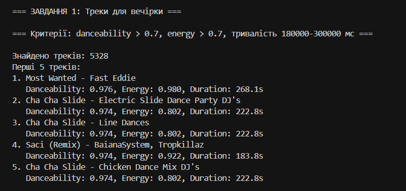
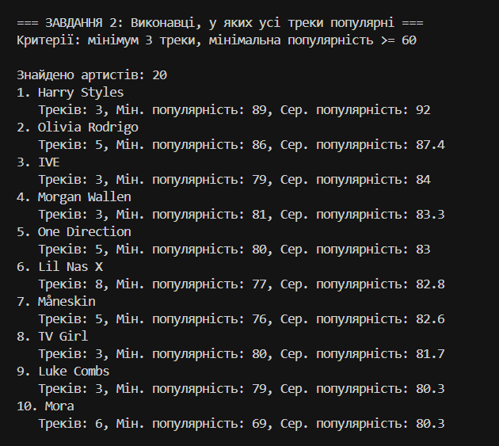
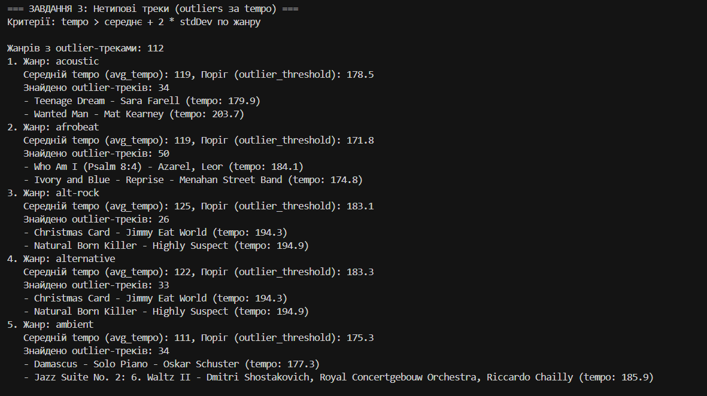
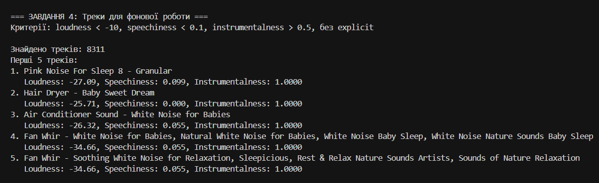

1. Для чого використовується інструкція $unwind?

$unwind використовується для розгортання масиву в окремі документи. У нашій схемі це актуально для полів на кшталт artists або track_genres: якщо в документі є масив із кількох значень, $unwind перетворює кожен елемент масиву на окремий запис у потоці агрегації. Це потрібно, коли далі треба групувати, рахувати або фільтрувати по кожному значенню окремо.

2. Чим $stdDevPop відрізняється від $stdDevSamp?

$stdDevPop і $stdDevSamp обидві обчислюють стандартне відхилення, але для різних моделей вибірки. $stdDevPop рахує відхилення для всієї сукупності, тобто ділить на N і підходить, коли дані вважаються повним набором. $stdDevSamp рахує вибіркове стандартне відхилення, тобто ділить на N−1, і краще підходить, коли дані є лише вибіркою з більшої генеральної сукупності.

## Частина 3 — Аналітика через Aggregation Pipeline

Запити виконуються скриптом `queries/part3_aggregations.js`. Додаткові порівняння порогів для теоретичних відповідей — `queries/part3_threshold_experiments.js`.

Примітка: у **Task 1** використано `$lookup` + `$unwind` (self-lookup) для того, щоб для кожного артиста з топ-10 підтягнути його **найпопулярніший трек**.

Артефакти запуску (скріншоти з термінала):

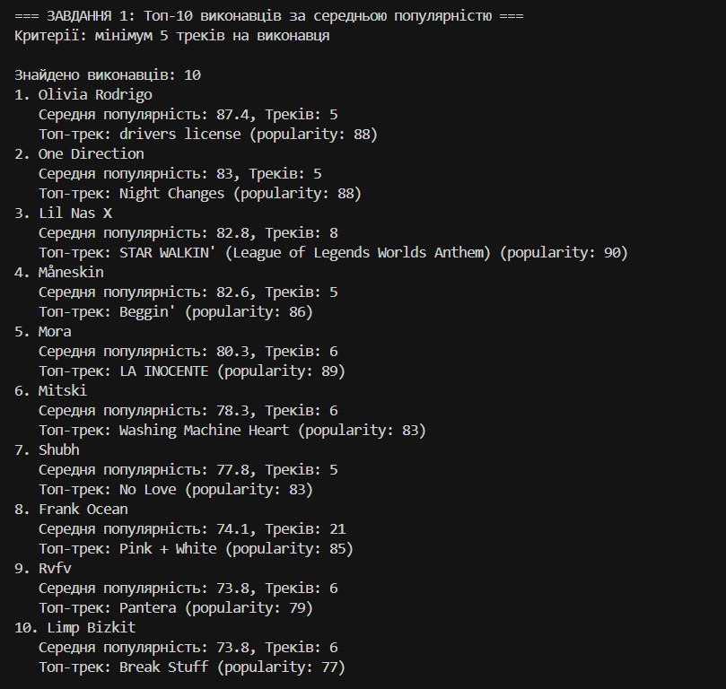
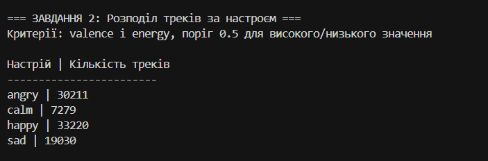
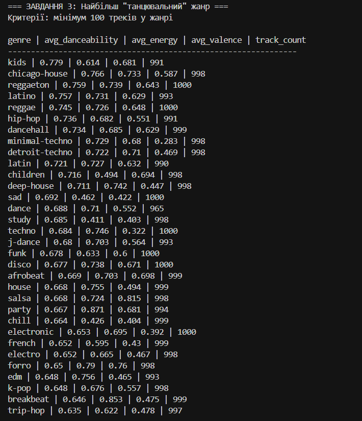


1. У запиті 1 ми фільтруємо виконавців, у яких менше 5 треків. Як зміниться результат, якщо знизити поріг до 1? А що станеться, якщо вибирати виконавців із більш ніж 50 треками? Поясніть результат.

Якщо знизити поріг у запиті 1 з 5 до 1, результат стане значно ширшим: у вибірку потраплять майже всі артисти з хоча б одним треком. Це зробить топ-10 менш статистично стабільним, бо артисти з 1-2 треками будуть ранжуватися за середньою популярністю, яка для них фактично дорівнює популярності одного треку. Такий результат легко спотворюється “one-hit wonders” і не дуже добре відображає реальну середню популярність виконавця.
Якщо, навпаки, підняти поріг до більш ніж 50 треків, список різко звузиться. У вибірку потраплять лише дуже “продуктивні” артисти з великою дискографією, тому середня популярність стане більш надійною, але кількість кандидатів може бути дуже малою і через це середня популярність буде нижча; це видно з емпірики нижче.

Емпірична перевірка (`queries/part3_threshold_experiments.js`): ті самі кроки, що в завданні 1, але без `$lookup` (для швидкості порівняння порогів) — тоді як у звіті для Task 3.1 лишається повний пайплайн з підтягуванням топ-треку.

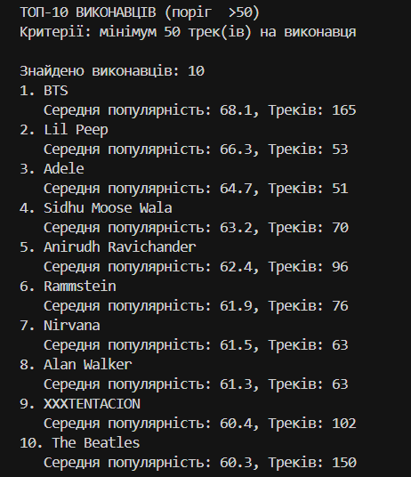

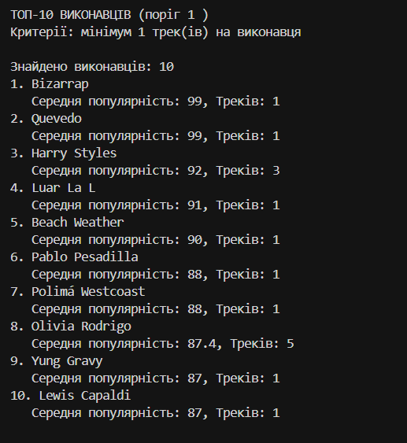

2. У запиті 3 ми фільтруємо жанри з менше ніж 100 треками. Чи зміниться результат, якщо знизити поріг до 50? Поясніть результат.

У запиті 3 поріг у 100 треків відсікає жанри з дуже малою кількістю документів, щоб середні значення `avg_danceability`, `avg_energy` і `avg_valence` були більш надійними. Якщо знизити поріг до 50, до результату могли б потрапити ще рідкісніші жанри. Це не змінює сам підхід, але додає жанри з меншою статистичною стабільністю, тому рейтинг “найтанцювальніших” жанрів стає менш надійним. У нашому датасеті це не змінює результат, оскільки всі жанри, що потрапили до вибірки, мають 900+ треків. Отже, цей поріг працює як захист статистичної значущості.

Порівняння тієї самої агрегації (як у `ЗАВДАННЯ 3` у `part3_aggregations.js`) з порогами **≥100** та **≥50** треків у жанрі. Через розмір виводу — два скріншоти:

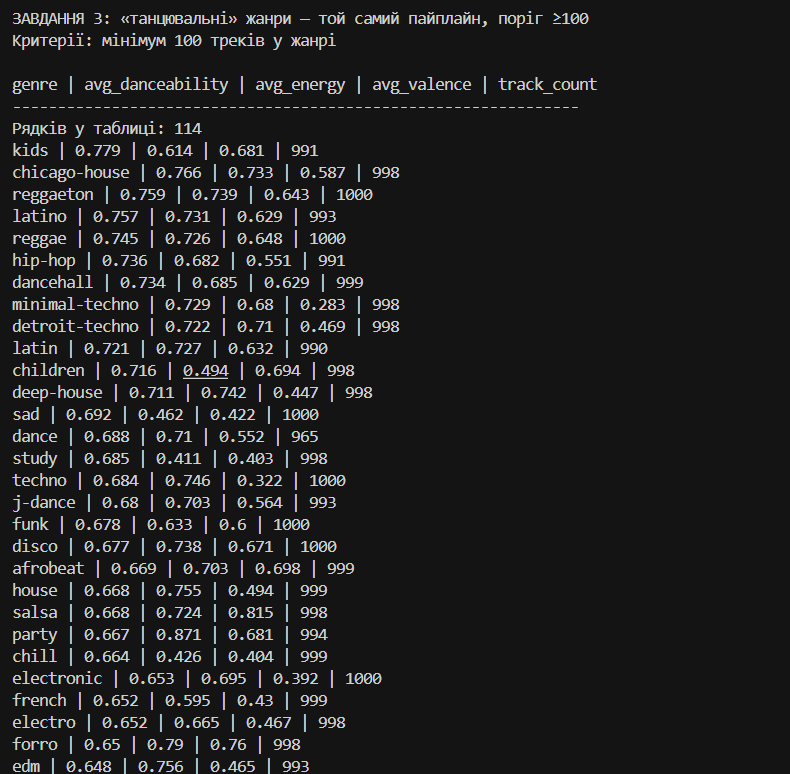

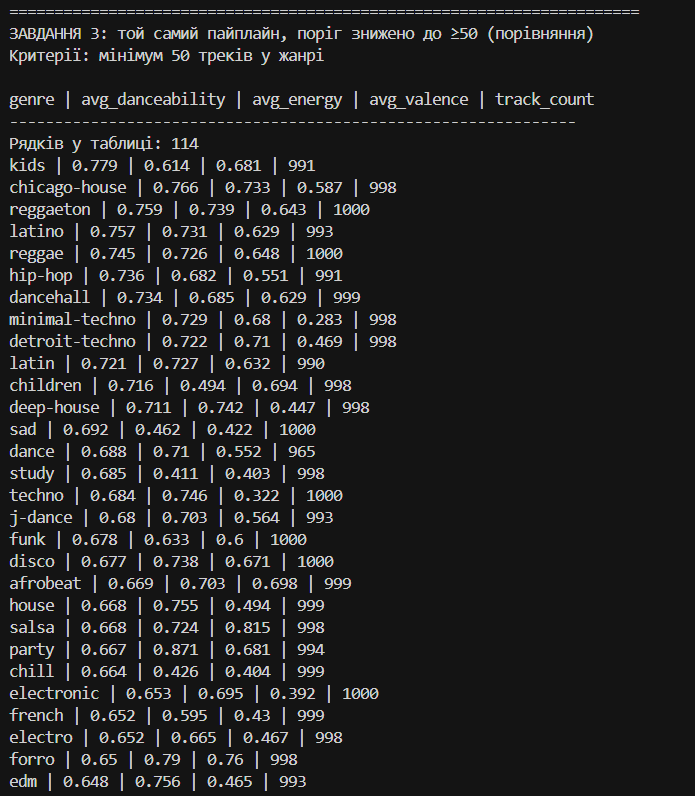

Частина 4 — Індекси та оптимізація
Завдання 1. Аналіз запиту та індексація

Актуальний результат (з `leafStage`, щоб стабільно бачити `COLLSCAN/IXSCAN`):
- **до індексу**: `leafStage: COLLSCAN`, `totalDocsExamined: 89740`, `executionTimeMillis ~ 88`
- **після індексу**: `leafStage: IXSCAN` (план з `FETCH`), `totalDocsExamined: 353`, `totalKeysExamined: 411`, `executionTimeMillis ~ 3`

Скріншот:

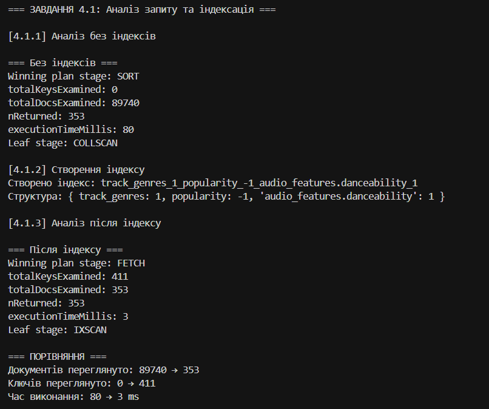

1. Що змінилося в плані виконання?

У плані виконання змінилося головне: замість повного перегляду колекції MongoDB почала використовувати індекс. До індексу план був SORT -> COLLSCAN, тобто база спочатку сканувала всі документи, а потім окремо сортувала результат. Після створення індексу план став FETCH -> IXSCAN, тобто спочатку MongoDB знайшла кандидати через індекс, а потім дочитала лише потрібні документи з колекції.

2. Як зрозуміти, що індекс використовується? Наведіть скріншот або значення полів із explain(), які це підтверджують.

Що індекс використовується, видно з таких полів explain():

- `leafStage: IXSCAN` — прямий сигнал, що пошук іде через індекс
- `winningPlanStage: FETCH` (разом з `leafStage: IXSCAN`) — індекс відфільтрував кандидати, а `FETCH` дочитує документи
- `totalDocsExamined: 89740 → 353` — кількість прочитаних документів різко зменшилась
- `totalKeysExamined: 411` — MongoDB перевірила індексні ключі, а не всю колекцію
- `executionTimeMillis` падає суттєво (значення може коливатись між прогонами)

Завдання 2. Індекс для інших полів

Для запиту work tracks індекс підтверджено через:
- **`leafStage: IXSCAN`** (індекс використовується)
- `totalDocsExamined: 89740 → 14170`, `totalKeysExamined: 0 → 14631`

Примітка: `executionTimeMillis` в Atlas може “плавати” між прогонами (кеш/навантаження), тому тут основний доказ — `IXSCAN` + падіння `DocsExamined`.

Скріншот:

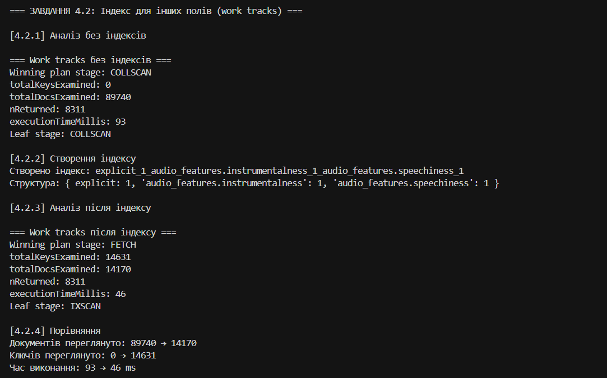

Завдання 3. Покривний запит
Запит
db.tracks_by_genres.find({
  track_genres: "pop",
  popularity: { $gte: 70 }
});
Цей запит не є покривним
Обґрунтування:

Покривний запит визначається як запит, для якого MongoDB може повернути результат виключно з даних індексу, без звернення до основної колекції. Для цього необхідно, щоб індекс містив усі поля, які використовуються в фільтрі, сортуванні та в проєкції результату. Крім того, запит не повинен мати явної проєкції, або проєкція повинна повертати лише індексовані поля.

Аналіз дослідного запиту показує, що:

Індекс використовується: виходячи з результату explain(), после створення індексу система перейшла від повного сканування колекції (COLLSCAN) до сканування індексу (IXSCAN), що підтверджується значенням inputStage: "IXSCAN".

Проте FETCH залишається необхідним: ключовим показником є те, що totalDocsExamined (кількість повних документів, витягнутих з колекції) дорівнює 317, що дорівнює числу повернутих документів (nReturned: 317). Для покритого запиту totalDocsExamined мав би дорівнювати 0, оскільки MongoDB не мав би потреби звертатися до основної колекції.

Причина необхідності FETCH: запит `.find({ track_genres: 'pop', popularity: { $gte: 70 } })` виконується **без проєкції**, тобто повертає весь документ. Це означає, що MongoDB має звернутися до основної колекції, щоб прочитати поля, яких немає в індексі. Для covered query в `explain()` має бути `totalDocsExamined: 0` (і, як правило, відсутній `FETCH` у winningPlan).

Для того щоб цей запит став покривним, необхідно:

Переконатися, що індекс містить усі потрібні поля:
db.tracks_by_genres.createIndex({ track_genres: 1, popularity: 1 })

Виконати запит з явною проєкцією, яка повертає тільки індексовані поля:
db.tracks_by_genres.find({ track_genres: 'pop', popularity: { $gte: 70 } },
  {_id: 0, track_genres: 1, popularity: 1 }
 )

**Результат covered query з проєкцією**: `totalDocsExamined` лишається `> 0`, тож запит все одно **не covered** (для covered очікуємо `totalDocsExamined: 0`).

Скріншот:

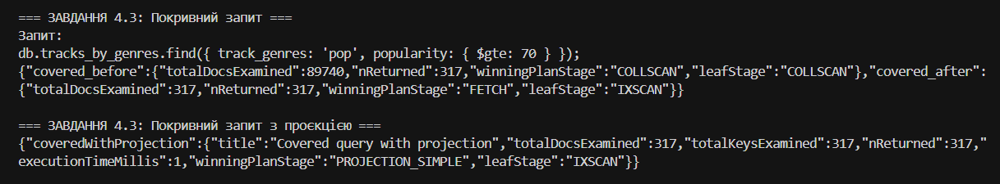

**Аналіз результату:**

Навіть запит з проєкцією **НЕ є покривним** у цьому випадку. Доказ:

- `totalDocsExamined: 317` — MongoDB все одно прочитала 317 повних документів з колекції
- `inputStage: "FETCH"` — присутня стадія FETCH, що означає читання основної колекції
- `winningPlanStage: "PROJECTION_SIMPLE"` — проєкція застосована на результати FETCH, а не на дані індексу

**Коренева причина — multikey + проєкція масивного поля:**

Індекс на полі `track_genres` — **multikey** (бо це масив). У цьому конкретному випадку навіть із проєкцією covered query не виходить, бо:

- запит фільтрується по multikey-полю `track_genres`
- і проєкція повертає `track_genres` (масив), тож оптимізатор все одно обирає план із `FETCH` (це видно в `explain()` як `inputStage: "FETCH"` і `totalDocsExamined > 0`)

Практичний критерій “покриття” тут простий: **поки `totalDocsExamined` не дорівнює 0 — запит не covered**, незалежно від того, що індекс використовується (`IXSCAN`).

**Висновок:**

Розглянутий запит демонструє практичне обмеження MongoDB: покриття неможливо з multikey індексами. Це важливо враховувати при дизайні схеми і індексації — якщо потрібне покриття, слід уникати масивних полів у фільтраційних умовах або використовувати альтернативні підходи (наприклад, денормалізація або перепроєктування схеми).

---

### Скріншоти (артефакти запуску)

Загальна перевірка виконання частини 1 (завантаження/трансформація):

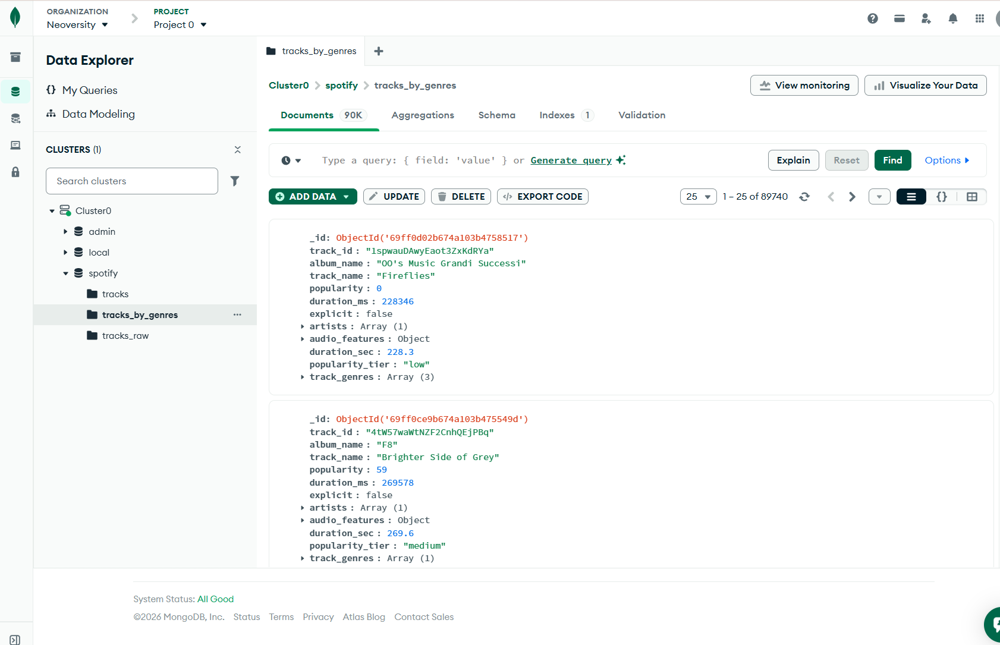
